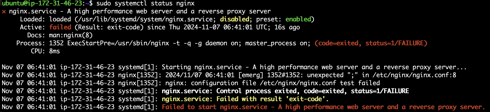

# Root Cause Analysis

## 初始問題

透過 SSH 進入 EC2 Instance，執行以下指令：

```
curl localhost
```

結果顯示：


這表示 port 80 被某個非 Nginx 的服務佔用。

## 排查步驟與分析

### 1. 啟動 Nginx 服務

執行以下指令：

```
sudo systemctl start nginx
```

結果顯示服務啟動失敗：


### 2. 查看 Nginx 狀態

執行以下指令：

```
sudo systemctl status nginx
```

結果顯示 Nginx 配置文件 `/etc/nginx/nginx.conf` 出現解析錯誤（unexpected ";"）。



### 3. 修正配置文件錯誤

執行以下指令，並修正語法錯誤：

```
sudo nano /etc/nginx/nginx.conf
```


修正完後使用以下指令進行語法檢查：

```
sudo nginx -t
```

得到的結果顯示：語法正確，配置文件測試成功。


### 4. 再次啟動 Nginx

執行以下指令：

```
sudo systemctl restart nginx
```

但結果仍遇到啟動失敗的問題:


### 5. 再次檢查 Nginx 狀態

執行以下指令：

```
sudo systemctl status nginx
```

結果顯示 Nginx 無法綁定到 0.0.0.0:80，並提示 Address already in use，表示某個服務已經佔用 port 80。

### 6. 檢查端口佔用情況

執行以下指令檢查哪個 process 佔用 port 80：

```
sudo lsof -i :80
```

查到 PID 576 的 `srv` 正在使用 port 80：


### 7. 停止佔用端口的 process

執行以下指令：

```
sudo kill -9 576
```

之後重啟 Nginx，再重新檢查 Nginx 狀態，確認 Nginx 已經成功運行。


### 8. 測試連線狀態

再次執行以下指令：

```
curl localhost
```

結果顯示 port 80 無法連線到本地的 Nginx 伺服器。


### 9. 檢查防火牆規則

執行以下指令：

```
sudo iptables -L
```

發現有一條規則在 INPUT 中阻止了 HTTP 請求。


### 10. 清除防火牆規則

執行以下指令，並確認所有規則已被清除：

```
sudo iptables -F
```


### 11. 重新啟動 Nginx

執行以下指令：

```
sudo systemctl restart nginx
```

結果發現 403 Forbidden 錯誤，代表伺服器拒絕提供請求資源。


### 12. 更改權限

執行以下指令，確保 `/var/myweb` 以及其中的檔案擁有正確權限：

```
sudo chmod 755 /var/myweb
sudo chmod 644 /var/myweb/index.html
```

再更改目錄和檔案的所有者，確保 Nginx 擁有適當權限：

```
sudo chown -R www-data:www-data /var/myweb
```

檢查配置檔案後，重新載入 Nginx 配置：

```
sudo nginx -t
sudo systemctl reload nginx
```


### 13. 最終測試

重啟 Nginx 並執行以下指令：

```
curl localhost
```

結果顯示正確的網頁內容，問題成功解決！


## 心得與收穫

在這次 troubleshooting 的過程中，我學到了如何系統性的排查 Web Server 問題，包括檢查服務狀態、驗證配置檔、檢查端口佔用情況以及防火牆設定等。這些技能對於日後處理類似問題非常有幫助。此外，我也學到每一步的排查都是建立在對問題的假設與驗證之上，這讓我能夠更有條理地解決複雜的問題。
